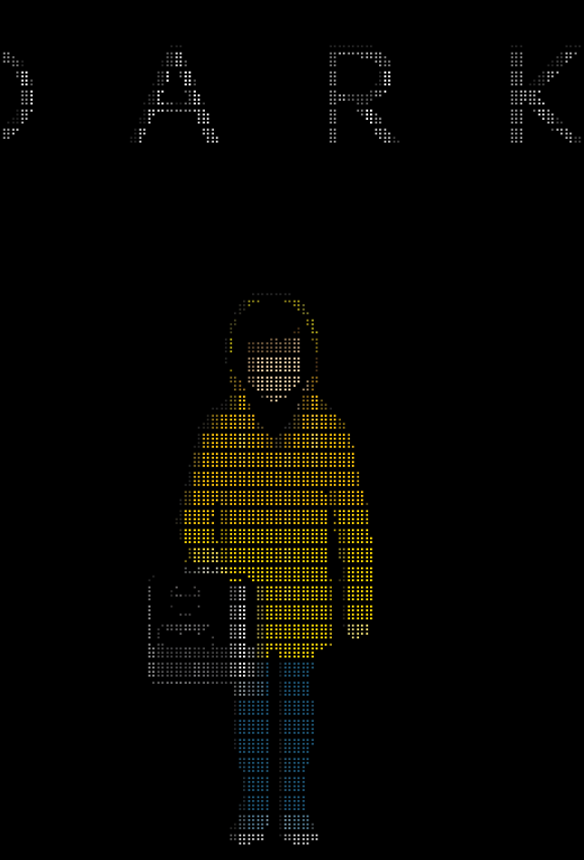

# Image to Text Art

A command line utility to convert an image to text art.

## Installation

Ensure that the required dependencies are installed.

```bash
pip install -r requirements.txt
```

## Usage

```bash
python main.py
```

```
usage: image-to-text-art [-h] [-o] [-c] [-v] [-W] [-H] [-r]
                         source {ascii,braille} ...

Image to Text Art

positional arguments:
  source           path to source image
  {ascii,braille}
    ascii          apply ASCII
    braille        apply Braille

optional arguments:
  -h, --help       show this help message and exit
  -o , --output    path to output file
  -c, --color      keep color
  -v, --verbose    verbose output
  -W , --width     width of output in characters
  -H , --height    height of output in characters
  -r, --ratio      preserve aspect ratio
```

## Examples

Consider the following poster:

<p align="center"></p>

### ASCII

#### [Grayscale](./assets/ascii-gray.txt)

```bash
python main.py assets/example.jpg -v -r -o assets/ascii-gray.txt ascii
```

#### [Colorized](./assets/ascii-color.txt)

```bash
python main.py assets/example.jpg -v -r -c -o assets/ascii-color.txt ascii
```

### Braille

#### [Grayscale](./assets/braille-gray.txt)

```bash
python main.py assets/example.jpg -v -r -o assets/braille-gray.txt braille -t 64
```

#### [Colorized](./assets/braille-color.txt)

```bash
python main.py assets/example.jpg -v -r -c -o assets/braille-color.txt braille -t 64
```

<p align="center"></p>