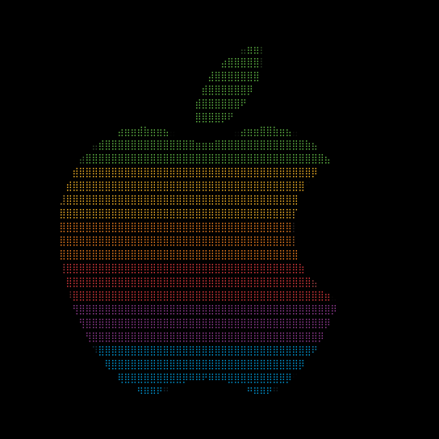
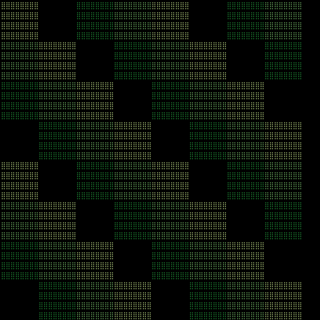

# `picharsso draw braille`

*Use the [Braille style](../../styles/braille.md).*

??? example "Example"
    Consider the following image:

    <div align="center">
        <p>
            
        </p>
        <p>
            <em>Apple Computer [Rob Janoff, 1977]</em>
        </p>
    </div>

    Here's what it should look like:

    <div align="center">
        
    </div>

## Usage

```bash
picharsso draw braille [options]
```

## Options

### `-t`, `--threshold` `INTEGER` `RANGE`
:   *Threshold pixel luminance (from grayscale). [default: 64]*

    ??? example
        Consider the following image:

        <div align="center">
            <p>
                
            </p>
            <p>
                <em>Tiles ressembling GitHub contributions</em>
            </p>
        </div>

        ```bash
        picharsso draw -c -H 32 docs/assets/images/subjects/contributions.webp braille -t <threshold>
        ```

        Here's what it should look like:

        === "threshold = 0"
            <div align="center">
                
            </div>

        === "70"
            <div align="center">
                
            </div>

        === "108"
            <div align="center">
                
            </div>

        === "168"
            <div align="center">
                
            </div>

        === "210"
            <div align="center">
                
            </div>

### `-h`, `--help`
:   *Show this message and exit.*

    ??? abstract "Message"
        ```
        --8<-- "docs/snippets/cli/draw/braille/help.txt"
        ```
