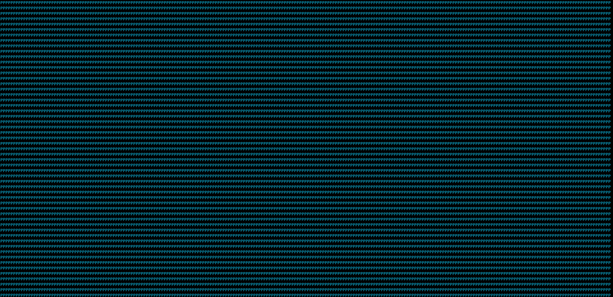

# `picharsso draw`

*Generate text art from an image.*

## Usage

```
picharsso draw [options] <path> <command> [args]
```

## Arguments

### `<path>`
:   *Path to the image file.*

## Options

### `-c`, `--colorize`
:   *Apply image colors to output text.*

    ??? example
        Consider the following image:

        <div align="center">
            <p>
                
            </p>
            <p>
                <em>Instagram</em>
            </p>
        </div>

        ```bash
        picharsso draw [-c] -H 32 docs/assets/images/subjects/instagram.webp gradient
        ```

        Here's what it should look like:

        === "colorize = False"
            <div align="center">
                
            </div>

        === "True"
            <div align="center">
                
            </div>

### `-m`, `--mode` [`ansi`|`html`]
:   *Format mode for output text.  [default: ansi]*

    !!! question "Formats"
        Refer to the [Formats documentation](../../formats/index.md)
        to learn about the supported output formats.

### `-r`, `--resample` [`nearest`|`box`|`bilinear`|`hamming`|`bicubic`|`lanczos`]
:   *Resampling filter.  [default: nearest]*

    ??? example
        Consider the following image:

        <div align="center">
            <p>
                
            </p>
            <p>
                <em>Starry Night [Vincent van Gogh, 1889]</em>
            </p>
        </div>

        ```bash
        picharsso draw -c -term-h -r <resample> docs/assets/images/subjects/starry-night.webp gradient -s "█"
        ```

        Here's what it should look like:

        === "resample = 'nearest'"
            <div align="center">
                
            </div>

        === "'box'"
            <div align="center">
                
            </div>

        === "'bilinear'"
            <div align="center">
                
            </div>

        === "'hamming'"
            <div align="center">
                
            </div>

        === "'bicubic'"
            <div align="center">
                
            </div>

        === "'lanczos'"
            <div align="center">
                
            </div>

### `-H`, `--height` `INTEGER`
:   *Height of output text in characters.*
    *If 0, derives from width.  [default: 0]*

    !!! info "Lines"
        `height` is the number of lines in the text output.

    ??? example
        Consider the following image:
        
        <div align="center">
            <p>
                
            </p>
            <p>
                <em>Zima Blue [Zima]</em>
            </p>
        </div>

        ```bash
        picharsso draw -c -H 32 docs/assets/images/subjects/zima.webp gradient
        ```

        Here's what it should look like:

        <div align="center">
            
        </div>

### `-W`, `--width` `INTEGER`
:   *Width of output text in characters.*
    *If 0, derives from height.  [default: 0]*

    !!! info "Characters per line"
        `width` is the number of characters (including whitespace) per line in the text output.

    ??? example
        Consider the following image:
        
        <div align="center">
            <p>
                
            </p>
            <p>
                <em>Zima Blue [Zima]</em>
            </p>
        </div>

        ```bash
        picharsso draw -c -W 32 docs/assets/images/subjects/zima.webp gradient
        ```

        Here's what it should look like:

        <div align="center">
            
        </div>

### `-term-h`, `--terminal-height`
:   *Sets height to terminal height.*

    ??? example
        Consider the following image:
        
        <div align="center">
            <p>
                
            </p>
            <p>
                <em>Zima Blue [Zima]</em>
            </p>
        </div>

        ```bash
        picharsso draw -c -term-h docs/assets/images/subjects/zima.webp gradient
        ```

        Here's what it should look like:

        <div align="center">
            
        </div>

    ??? bug
        When used while [piping](https://en.wikipedia.org/wiki/Pipeline_(Unix)){target=_blank},
        `height` is set to the default terminal height,
        which is usually `24`.
      
### `-term-w`, `--terminal-width`
:   *Sets width to terminal width.*

    ??? example
        Consider the following image:
        
        <div align="center">
            <p>
                
            </p>
            <p>
                <em>Zima Blue [Zima]</em>
            </p>
        </div>

        ```bash
        picharsso draw -c -term-w docs/assets/images/subjects/zima.webp gradient
        ```

        Here's what it should look like:

        <div align="center">
            
        </div>

    ??? bug
        When used while [piping](https://en.wikipedia.org/wiki/Pipeline_(Unix)){target=_blank},
        `width` is set to the default terminal width,
        which is usually `80`.

### `-h`, `--help`
:   *Show this message and exit.*

    ??? abstract "Message"
        ```
        --8<-- "docs/snippets/cli/draw/help.txt"
        ```

## Subcommands

!!! question "Styles"
    Refer to the [Styles documentation](../../styles/index.md)
    for an in-depth guide to the **image processing behind Picharsso**.

### [`braille`](braille.md)
:   Use the [Braille style](../../styles/braille.md).

### [`gradient`](gradient.md)
:   Use the [gradient style](../../styles/gradient.md).

