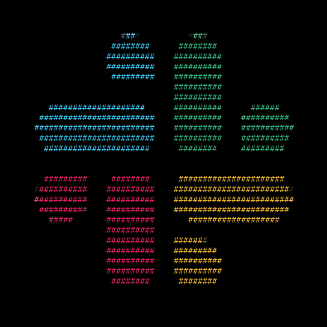
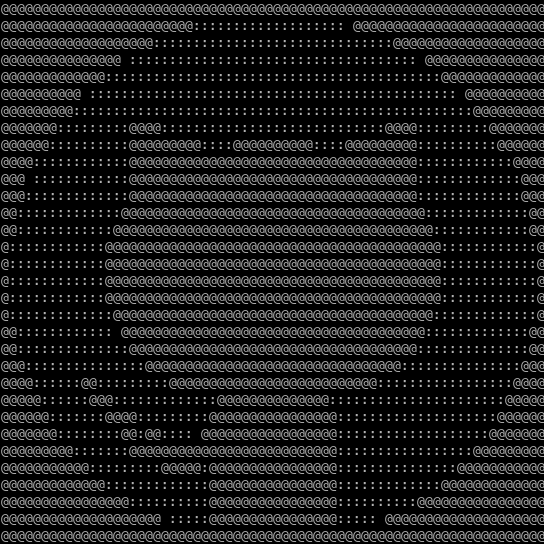

# Gradient

This style uses [Unicode characters](https://en.wikipedia.org/wiki/Unicode){target=_blank}.

??? example "Example"
    Consider the following image:

    

        

            
        

        

            <em>Apple Computer [Rob Janoff, 1977]</em>
        

    

    Here's what it should look like:

    

        
    

## Procedure

This style is implemented using the [`GradientDrawer`][picharsso.draw.gradient.GradientDrawer].

!!! question "Styling"
    Refer to the [procedure](./index.md#procedure) outlined in the Styles documentation
    for an overview of the **steps common to all styles**.

### Initialization

#### Charset

The `charset` parameter is a string containing characters **ordered by their
perceived brightness**.

Consider the following image:

    

        
    

    

        <em>Slack</em>
    

Here's what it should look like:

=== "charset = ' :!?PG@' (default)"
    

        
    

=== "'.'"
    

        
    

=== "'#'"
    

        
    

=== "'█'"
    

        
    

#### Negative

The `negative` parameter controls whether the `charset` must be **reversed**.

Consider the following image:

    

        
    

    

        <em>GitHub</em>
    

Here's what it should look like:

=== "negative = False"
    

        
    

=== "True"
    

        
    

#### Matrices

The `charset_array` attribute holds a NumPy [`ndarray`](https://numpy.org/doc/stable/reference/generated/numpy.ndarray.html){target=_blank}
containing all the characters in the `charset`.

### Conversion

#### Resizing

Assuming the output text should have the dimensions `text_height` and `text_width`,
the image must be resized according to the following criteria:

*   `image_height = text_height`.
*   `image_width = text_width`.
*   If either `image_height` or `image_width` is `0`,
    it is derived from the other by preserving the aspect ratio of the original image.

Following the above algorithm, **each pixel** of the resized `image`
will be assigned to **one character** in the output text.

??? abstract "Source"
    Refer to the [`calculate_size` function][picharsso.draw.gradient.GradientDrawer.calculate_size]
    for more information.

#### Processing

1. The resized `image` is first converted to its grayscale.
2. The image matrix is normalized such that the grayscale range shifts from `(0, 255)` to `(0, len(charset))`.
3. The `charset_array` is indexed with the resultant "indices" matrix,
    giving the final `text_matrix`.

    

??? abstract "Source"
    Refer to the [`process` function][picharsso.draw.gradient.GradientDrawer.process]
    for more information.
